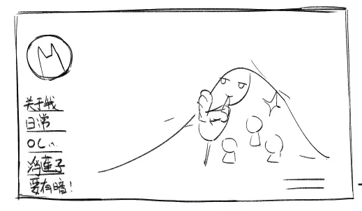
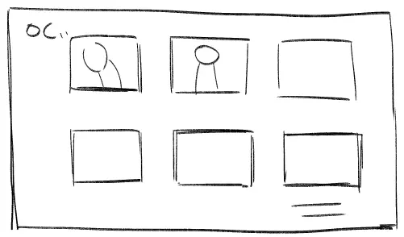
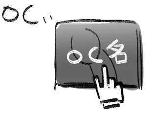
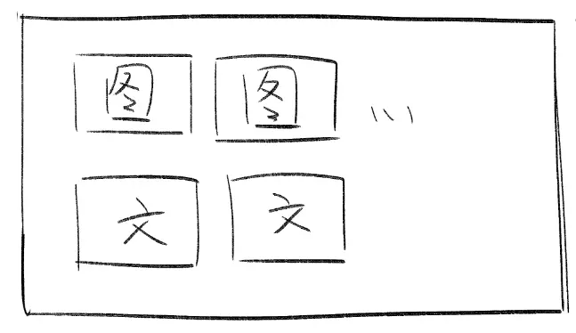

## 写在前面

由于LOFTER作妖而打算干脆学着搭建一个个人网站。

参考了塔塔的教程，也受到了黑糖和CD的很多帮助，作为一个完全一窍不通的人能被这样帮助真的非常感谢；；

虽然其实我现在应该去做毕设的…但果然除了正事儿之外啥都能做啥都想做！那么打算写一下关于博客的规划和想法吧。

首先，冷静下来仔细想想就会发觉我对于博客——或者说个人网站的需求和其他人是不一样的。做这个网站实际上最后是想要一个可以集中展示我OC+跑团LOG的地方，~~因为认真写日记和发表想法这件事我会在群聊和社交平台里搞定，~~但目前初步了解了一下hugo的themes主题发现似乎并不能很好地进行归档…？
后来证明只是我自己的想法没有太好落实的想法。

## 正文

总而言之，思考了片刻暂且先列出一个理想中的模样：

  

左侧的栏目本来是希望能把日常和OC之类的分开，但似乎右侧的tag栏也能实现…嗯…不过我想要的效果是：

 

  

但很明显这对我来说太复杂了…现学怎么写代码虽然听起来很燃，但做什么都还处于半吊子和容易丧失热情的我来说一个可用的方案比完美符合期望这件事更重要。

于是基于我惨淡的理解和知识，以下提出几种解决和替代方案。

* **方案1：再建一个子网站…类似LOF的子博**
其实这是可行的，而且可行性应该不低，这个方案就可以兼容一个网站不能搭载两种主题的问题了并且塔塔还写了教程（？）甚至我可以把个人作品（求职）也再建一个类似的网站来展示，但这样套圈圈大肠包小肠的方式会让我怀疑我为什么要买这个域名来着…？

* **方案2：利用N****otion或者WordPress建一个专门页**
与方案1看起来雷同，但二者均为动态博客。此方案也是便捷有效，但前者只能放文字（应该？）且有被墙风险，后者则多少有些臃肿，况且从LOFTER逃难选择了静态博客就代表我已经受不了看人脸色的日子了…！况且没有基础的话用wordpress编辑万一更新炸了也很麻烦，各种意义上的不算很愿意选这个方案。

* **方案3：厚脸皮找类似的功能进行替换和实现**
例如tag栏在这个主题里就是已经写好了的，其他人的hugo我也有发现类似单独的归档方式，缺点就是我完全不了解具体的操作，只能一点点问人…如果朋友可以接受我的有偿询问就好了orz

* **方案4：淘宝砸钱找人**
……字面意思！但介于我之前找人问低模建模甚至都要4000一个的情况来说我感觉自己能被薅到倾家荡产，而且说实话后续有别的想法又会很麻烦…还是不希望全权交给别人来处理。

**Q：所以为什么不自学呢？**

1. **没时间 。**听起来很像借口，至少现在是真的没时间，要做毕设没有那么多精力分出来，就算做完了毕设我也要投入无尽的画稿和搞作品集中…
2. **学习成本高。**个人网站建设并不在我认为一定要掌握或者钻研太深的事情里，我知道学习时间可以被拉的很长，但正如前文所说，对于做什么都还处于半吊子和容易丧失热情的我来说一个可用的方案比完美符合期望这件事更重要。人话就是，我会因为丧失热情半途而废，做完比做好更重要。
最后，总结一下目前我需要和应该能掌握的事：

- [ ] 总结md文件中常用的指令，熟悉格式
- [ ] 调整主页的布局，例如字体大小等
- [ ] 有时间多装修一下归档里的预览，实际上和我预想中的需求很接近，但是图片太小了
- [ ] 换一下缩略图标